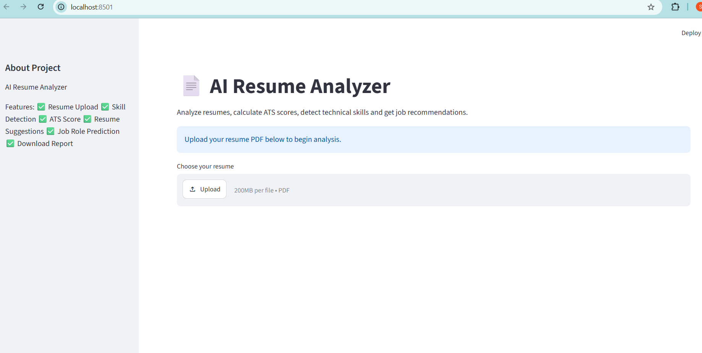
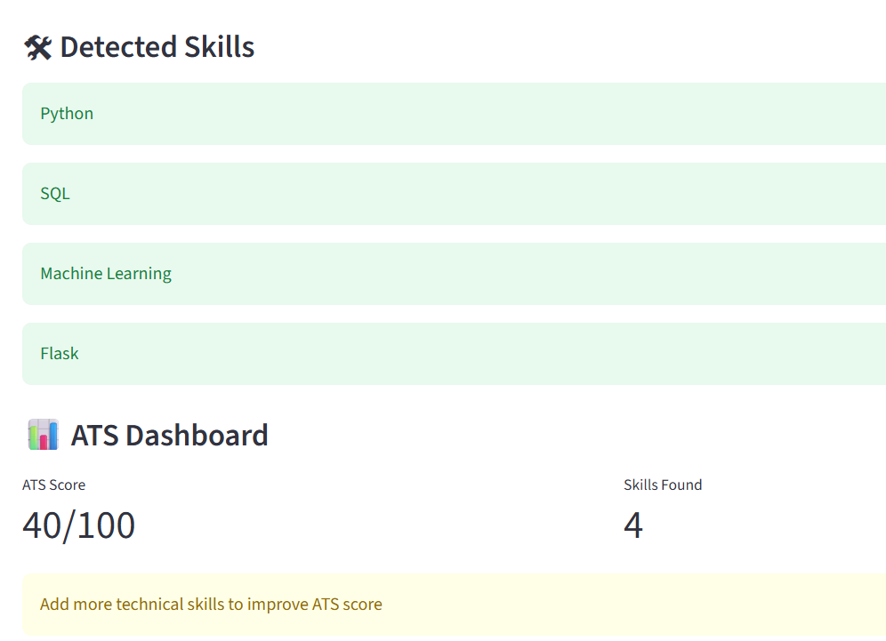

# AI Resume Analyzer

An AI-powered web application that analyzes resumes, extracts key skills, and evaluates resume relevance using an ATS-based scoring system.

## Features

- Resume Analysis
- Skill Extraction
- Resume Parsing
- ATS Scoring
- Resume Improvement Suggestions

## Technologies Used

- Python
- Flask
- Pandas
- NumPy

## Installation

1. Clone the repository

```bash
git clone https://github.com/srimathibaskaran10/ai-resume-analyzer.git
```

2. Install dependencies

```bash
pip install -r requirements.txt
```

3. Run the application

```bash
python app.py
```

## Project Output

The application analyzes uploaded resumes and generates:
- ATS Score
- Extracted Skills
- Resume Feedback
- Improvement Suggestions

- ## Screenshots

### Home Page


### Resume Analysis


### Results

